# Emulación Android y ejecución de PIVAA.apk con Genymotion y ADB

## 1. Descarga de PIVAA

```bash
mkdir -p ~/lab-pivaa
cd ~/lab-pivaa
wget https://github.com/HTBridge/pivaa/raw/master/apks/pivaa.apk
```

> Si `wget` falla, descarga el archivo desde el navegador y cópialo al directorio `~/lab-pivaa`.

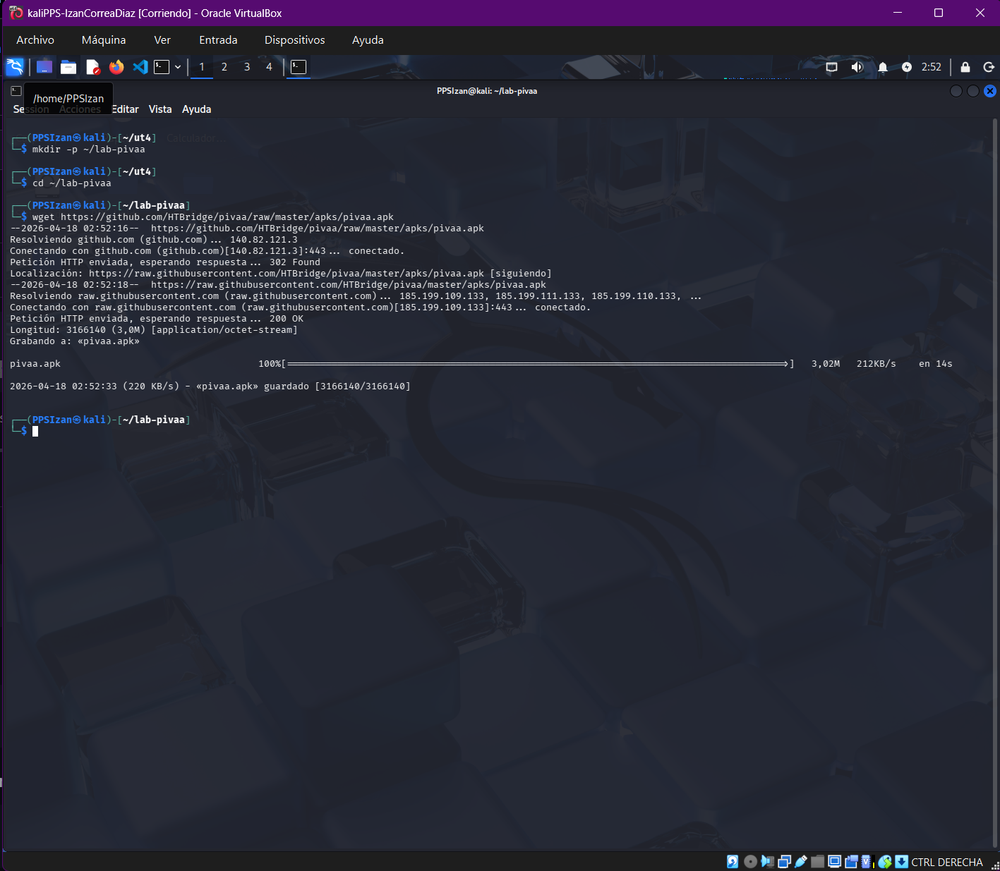

---

## 2. Análisis estático rápido con apktool

### 2.1. Instalar apktool

```bash
sudo apt update
sudo apt install apktool -y
```

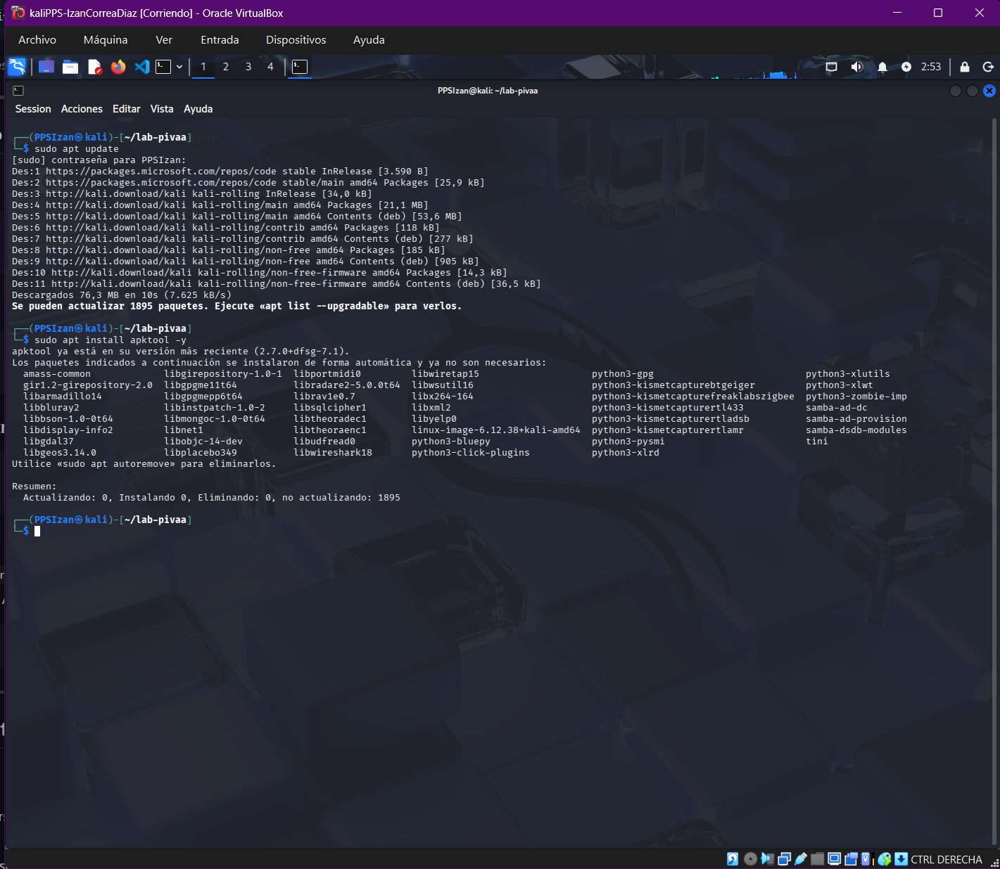

### 2.2. Desempaquetar PIVAA

```bash
cd ~/lab-pivaa
apktool d pivaa.apk -o pivaa_dec
```

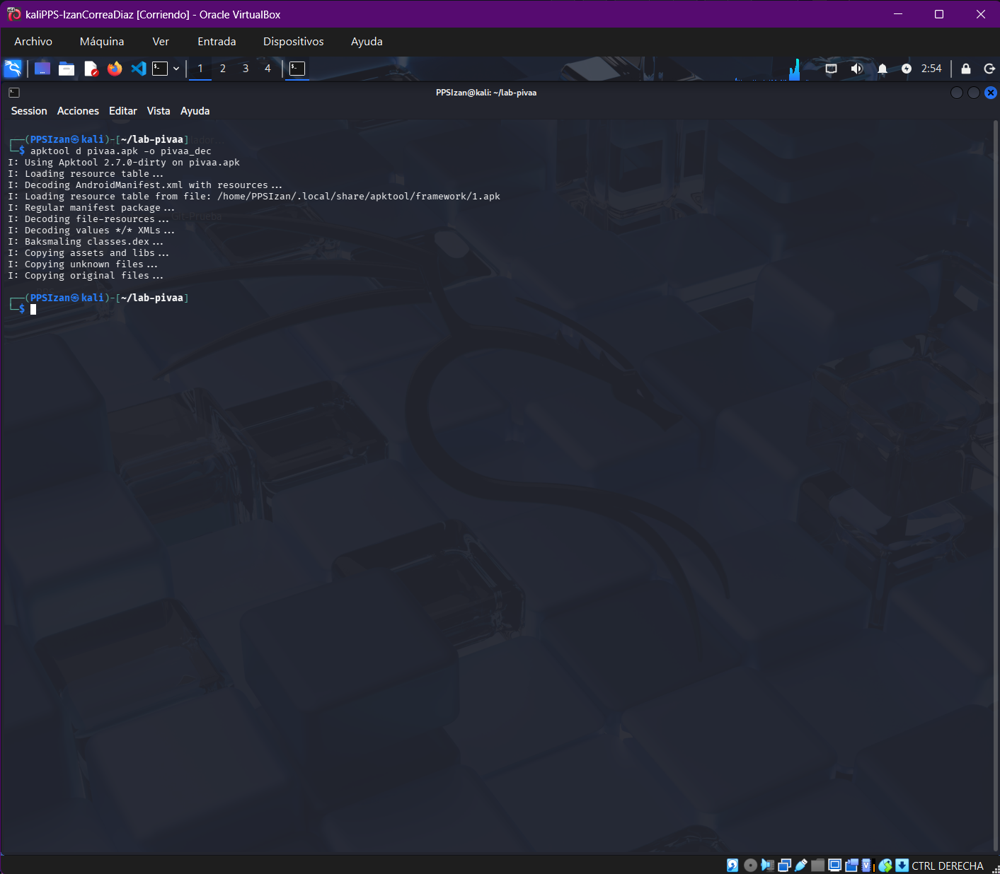

### 2.3. Revisar AndroidManifest.xml

```bash
cd pivaa_dec
nano AndroidManifest.xml
```

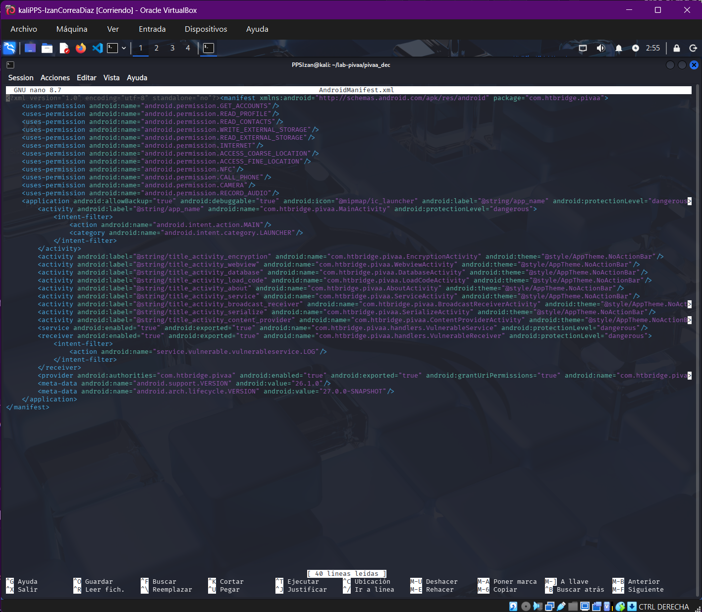

Comprueba:
- `targetSdkVersion` y `minSdkVersion` (versiones de Android objetivo y mínima)
- Nombre del paquete (lo usarás en ADB), debería ser `com.htbridge.pivaa`

```bash
cd ~/lab-pivaa
```

---

## 3. Instalación de Genymotion

### 3.1. Crear cuenta y descargar

1. Regístrate en [Genymotion](https://www.genymotion.com/account/create/) (uso personal)
2. Confirma el correo electrónico
3. Descarga Genymotion Desktop desde [aquí](https://www.genymotion.com/product-desktop/download/)

### 3.2. Instalar Genymotion en Linux

```bash
# Copiar instalador (ajusta el nombre al que hayas descargado)
sudo cp ~/Descargas/genymotion-3.9.0-linux_x64.run /opt/

cd /opt
sudo chmod 755 genymotion-3.9.0-linux_x64.run
sudo ./genymotion-3.9.0-linux_x64.run
# Confirma con 'y' cuando lo pida
```

Se instalarán:
- `genymotion` → Interfaz gráfica
- `genymotion-shell` → Administración del emulador
- `gmtool` → Gestión por línea de comandos
- ADB se instala automáticamente

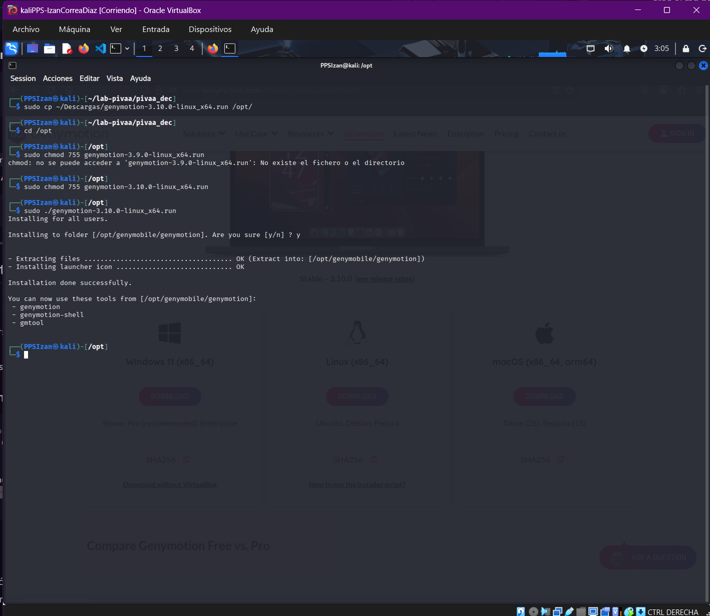

---

## 4. Crear y configurar el dispositivo virtual

### 4.1. Lanzar Genymotion

```bash
genymotion
```

1. Inicia sesión con tu cuenta
2. Selecciona **Personal use**

### 4.2. Crear dispositivo virtual

1. Pulsa **Create**
2. Selecciona un teléfono básico → **Custom Phone**
3. Pestaña **General**:
   - Versión de Android: **Android 5.0** o **Android 7.1.0 (Nougat)** x86
   - Nombre del dispositivo: `Android-7-PIVAA`
4. Pestaña **Android Options**:
   - Marca **Use virtual keyboard for test input**
5. Pestaña **Hypervisor Options**:
   - Red en modo **Bridge**
   - Interfaz: `eth0` (cable) o `wlan0` (wifi)
6. Pulsa **Install** y espera a que termine

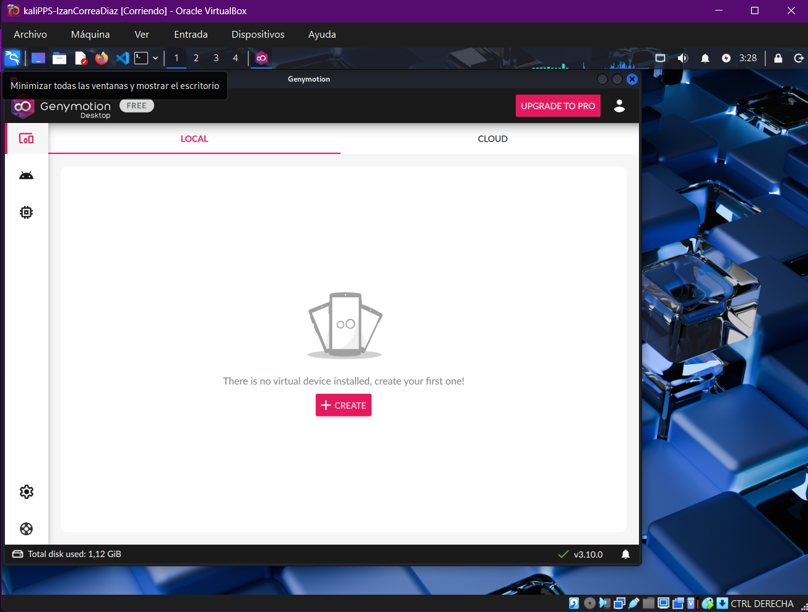
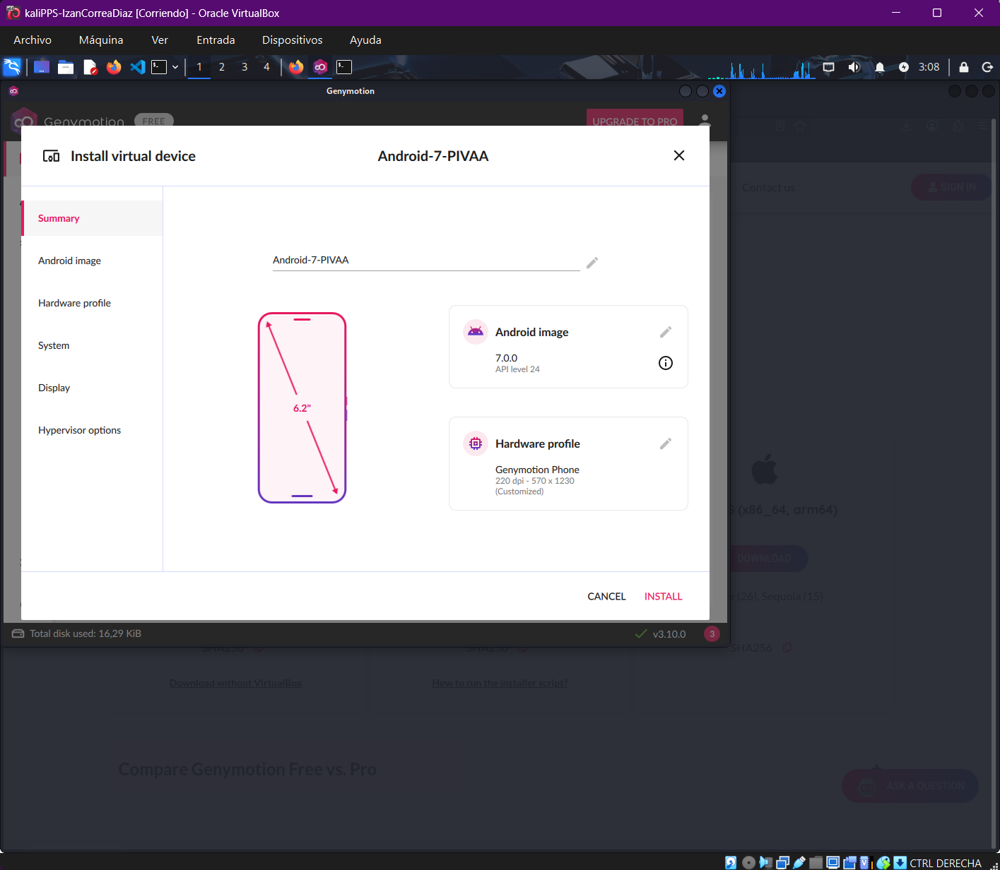


### 4.3. Iniciar el dispositivo

1. Selecciona tu dispositivo en la lista
2. Pulsa el icono de **Play**
3. Espera a que Android arranque completamente

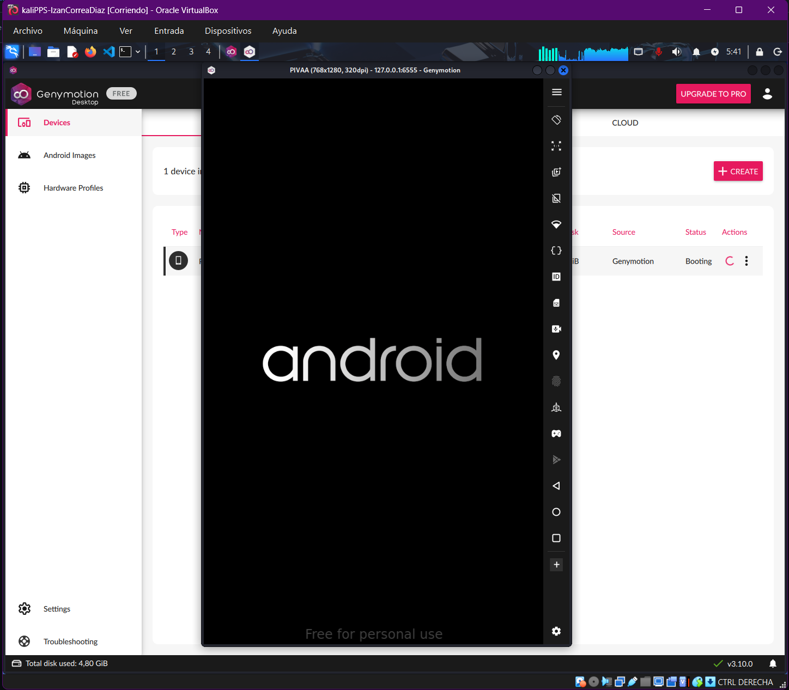

---

## 5. Comprobar conectividad y configurar ADB

### 5.1. Ver IP del dispositivo

En la barra superior de Genymotion verás la IP y puerto, por ejemplo: `127.0.0.1:6555`

### 5.2. Reiniciar ADB y listar dispositivos

```bash
adb kill-server
adb start-server
adb devices
```

Deberías ver:
```
List of devices attached
127.0.0.1:6555    device
```

### 5.3. Comprobar conexión e información

```bash
adb connect 127.0.0.1:6555

adb -s 127.0.0.1:6555 shell getprop ro.product.model
adb -s 127.0.0.1:6555 shell getprop ro.build.version.release
adb -s 127.0.0.1:6555 shell getprop ro.genymotion.version
```

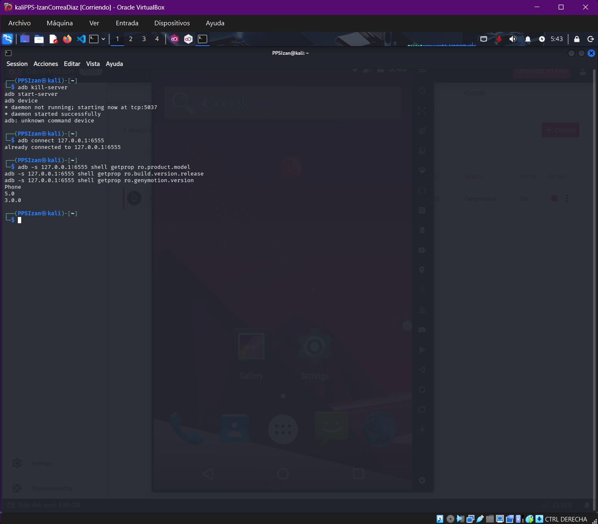

---

## 6. Instalar PIVAA en el emulador

### 6.1. Opción A: con ADB

```bash
cd ~/lab-pivaa
adb -s 127.0.0.1:6555 install pivaa.apk
```

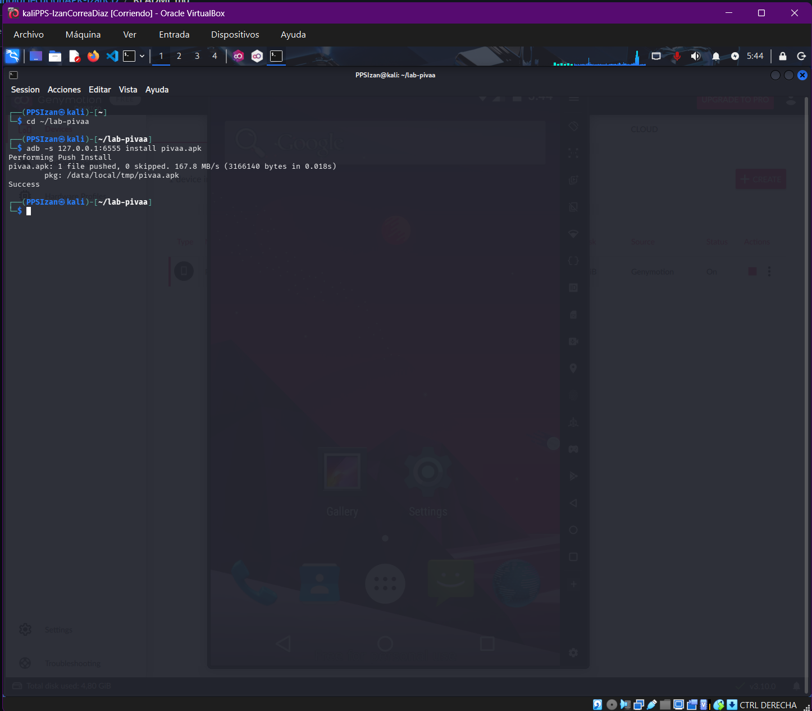


### 6.2. Opción B: arrastrar y soltar

1. Abre el emulador de Genymotion
2. Arrastra `pivaa.apk` desde tu explorador hasta la ventana del emulador
3. Espera a que se complete la instalación

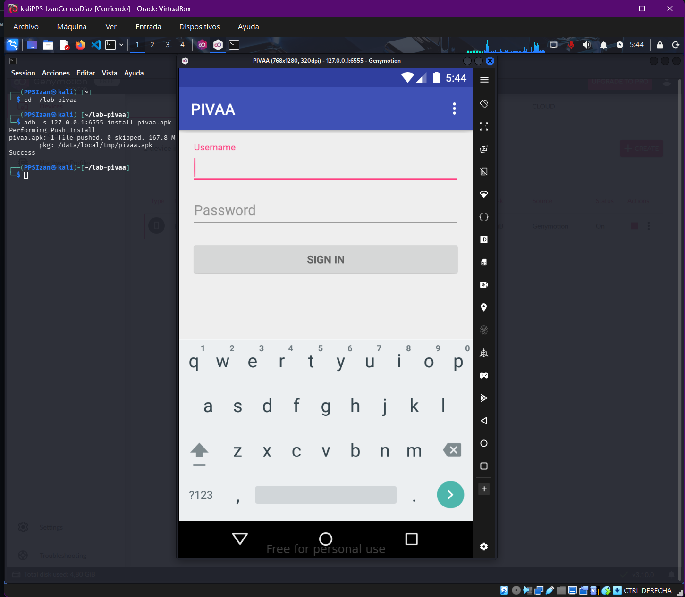

---

## 7. Ejecución de PIVAA

### 7.1. Login

1. Abre la app **PIVAA** en el emulador
2. Usuario: `admin`
3. Contraseña: `admin`
4. Pulsa **SIGN IN**

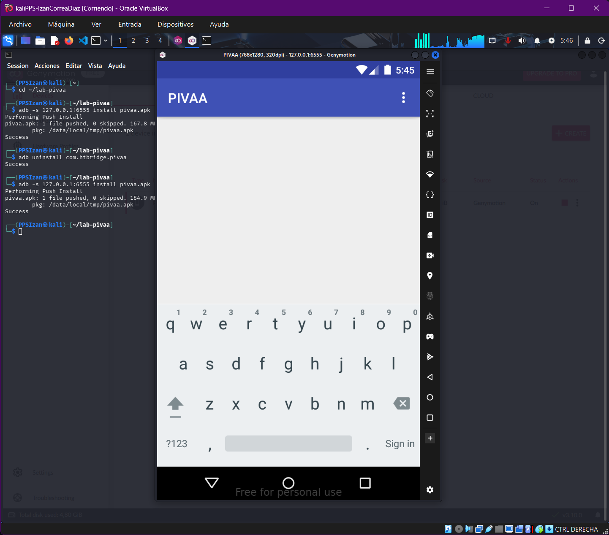
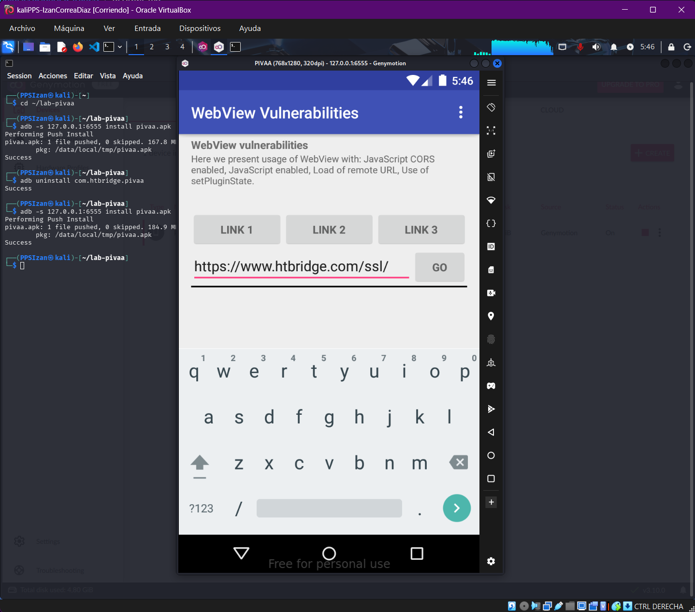

### 7.2. Ejemplo: explotación del servicio vulnerable

1. En el menú de la app (tres puntos), selecciona **Service**
2. Pulsa **Start Service** → comienza a grabar audio
3. El servicio `.handlers.VulnerableService` se ejecuta
4. Abre el explorador de archivos del emulador y localiza los ficheros de audio grabados

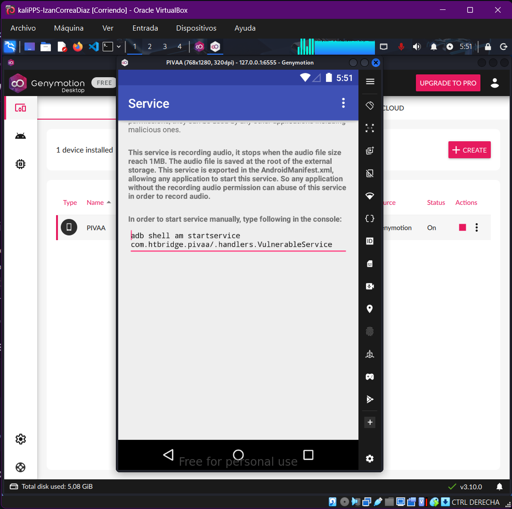
